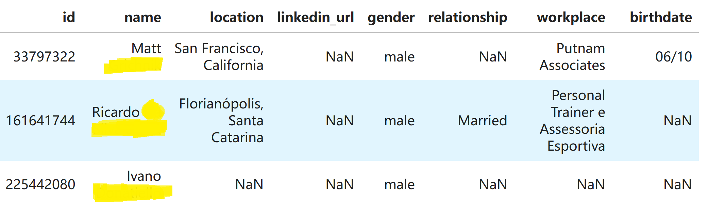
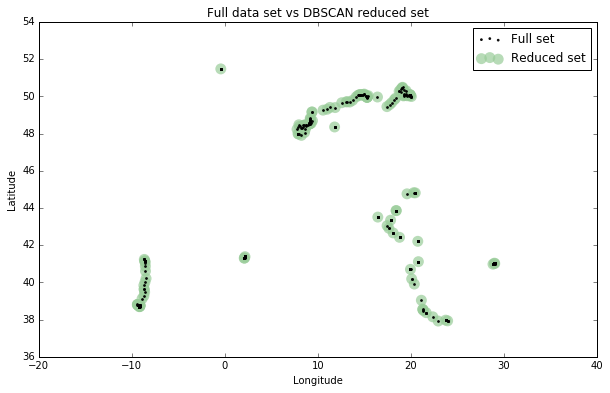

## 数据分析

已知有CSV表格数据，有如下信息：姓名、所在地、性别、感情状况、工作信息、生日等（表格单独发送，其中一些栏可能为空）。

请用[pandas](https://pandas.pydata.org)和[词云](https://github.com/amueller/word_cloud)，参考[这篇文章](https://geoffboeing.com/2014/08/clustering-to-reduce-spatial-data-set-size/)处理地理信息的方法，分析这个表格数据，以如下形式呈现分析结果：
1. 类似下图的职业信息的词云，出现频率最高的职业是哪些？

2. 统计不同情感关系状况的频率，并以柱状图呈现
3. 根据生日一栏计算年龄，统计后以直方图呈现
4. 统计所在地，将地点转换为经纬度，并以类似下图的形式呈现

